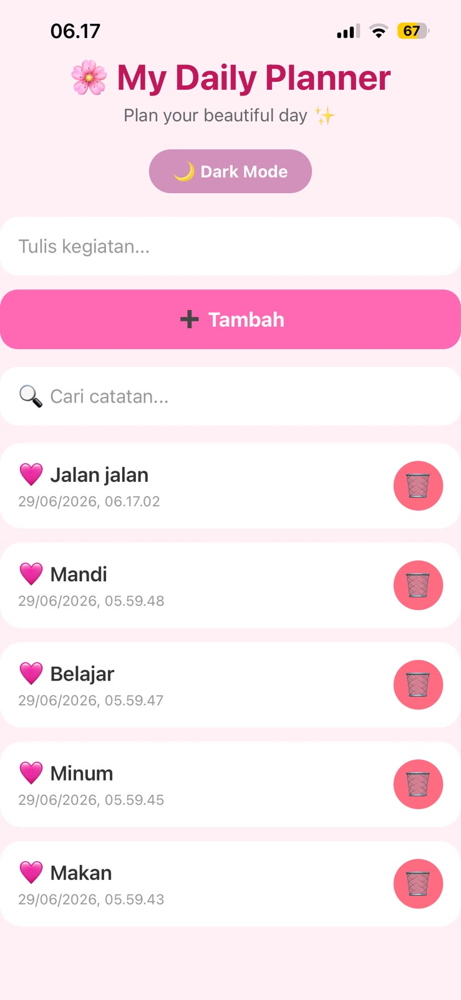
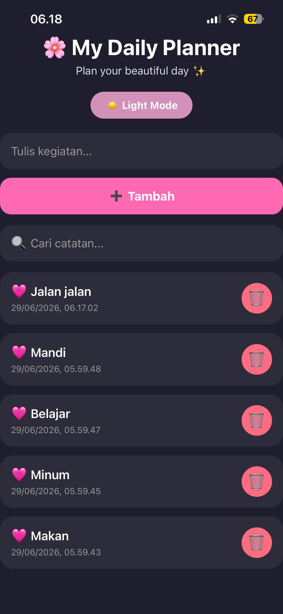
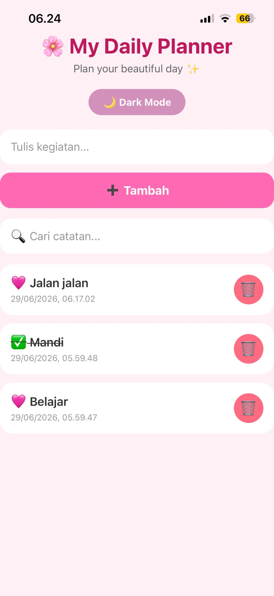

# 🌸 My Daily Planner

My Daily Planner adalah aplikasi pencatat kegiatan harian berbasis **React Native** menggunakan **Expo** dan **AsyncStorage**. Aplikasi ini memungkinkan pengguna untuk menambahkan, mencari, menandai status selesai, menghapus catatan, serta menyimpan data secara lokal sehingga tetap tersedia meskipun aplikasi ditutup.

---

## ✨ Fitur

### ✅ Level 1 (Core)

- Menambah catatan baru (Create)
- Menampilkan daftar catatan (Read)
- Menghapus catatan (Delete)
- Validasi input kosong
- Penyimpanan data menggunakan AsyncStorage
- Data tetap tersimpan setelah aplikasi ditutup (Persistence)
- Menampilkan daftar menggunakan FlatList
- Empty State ketika belum ada catatan

### ✅ Level 2

- 🌙 Dark Mode (tersimpan menggunakan AsyncStorage)
- 🔍 Search catatan
- ✅ Toggle status selesai
- 🗑️ Konfirmasi sebelum menghapus catatan

### ⭐ Bonus

- 📅 Timestamp pada setiap catatan

---

## 🛠️ Tech Stack

- React Native
- Expo SDK 54
- JavaScript
- AsyncStorage

---

## 🚀 Cara Menjalankan

1. Clone repository

```bash
git clone https://github.com/misyesinaga1-alt/NoteKeeper.git
```

2. Masuk ke folder project

```bash
cd NoteKeeper
```

3. Install dependency

```bash
npm install
```

atau

```bash
npx expo install
```

4. Jalankan aplikasi

```bash
npx expo start
```

5. Scan QR Code menggunakan aplikasi **Expo Go**.

---

## 📸 Screenshot

### 1. Halaman Utama

Menampilkan daftar catatan, kolom input, dan kolom pencarian.



---

### 2. Dark Mode

Menampilkan tampilan aplikasi saat Dark Mode aktif.



---

### 3. Toggle Status Selesai

Menampilkan catatan yang telah ditandai selesai.



---

### 4. Bukti Persistensi AsyncStorage

Data tetap tersimpan setelah aplikasi ditutup dan dibuka kembali.


---

## 💾 Penyimpanan Data

Aplikasi menggunakan **AsyncStorage** untuk menyimpan:

- Daftar catatan
- Pengaturan Dark Mode

Data akan tetap tersedia meskipun aplikasi ditutup dan dibuka kembali.

---

## 📱 Expo Snack

Tambahkan link Expo Snack setelah dibuat.

```
https://snack.expo.dev/
```

---

## 👩‍💻 Developer

**Misye Retno Wulansari Br. Sinaga**

GitHub:
https://github.com/misyesinaga1-alt

---

## 📄 Lisensi

Project ini dibuat untuk memenuhi tugas **Misi 12 - Build a Persistent App** pada mata kuliah React Native.
